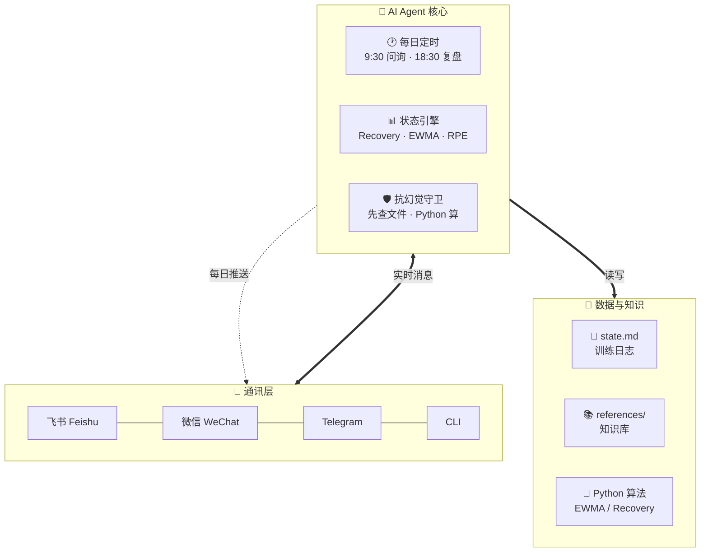

<p align="center">
  <a href="README_EN.md">🇺🇸 English</a> · <b>🇨🇳 中文</b>
</p>

<h1 align="center">🏋️ TiSu · AI 健身私教框架</h1>

<p align="center">
  <b>让 AI Agent 变身你的 24/7 贴身健身教练</b><br>
  通过飞书 / 微信 / Telegram 等通讯软件，实现每日自动跟练、状态追踪、周期化编程
</p>

<p align="center">
  
  
  
  
</p>

---

## 🔥 一句话

**把 AI Agent 接上飞书/微信，每天自动问你"今天练了吗"，根据你的状态动态出训练计划，不用自己记、不用自己算、不用自己编计划。**

---

## 🎯 首次使用：30 秒建立你的画像

第一次加载 skill，Agent 会自动问你一组基础信息，只问一次：

```
🏋️ 欢迎使用 TiSu 健身私教！

先让我了解你，以便制定个性化训练方案：

性别：？（男 / 女）
年龄：？
身高（cm）：？
体重（kg）：？
训练经验：？（新手 / 初中级 / 中高级 / 高级）
当前目标：？（增肌 / 减脂 / 增力 / 保持）
每周能练几天：？
有无伤病或限制：？
```

你回答完，Agent 就把这些存进 `state.md` 的 **用户画像** 区，之后所有计算（1RM 估测、BMR 估算、周期化设计、渐进负荷）都基于你的个人数据，不再重复问。

> 💡 **以后随时可以改**：直接说"更新我的数据"或"我体重现在 80kg 了"，Agent 自动 patch state.md。

---

## 🎯 这玩意儿是干嘛的

传统的健身教练软件需要你主动打开 App 记录。**TiSu 反过来**——AI Agent 通过通讯软件主动找你。

你每天早上在手机上收到一条消息：

```
📱 [飞书/微信] 早！今天感觉怎么样？
  体重：？ | 睡眠：？ | 精力（1-10）：？
  心情（1-10）：？ | 压力（1-10）：？
```

你回一句：

```
79.5 | 7h | 8 | 9 | 4
```

Agent 自动处理：
- ✅ 写入你的训练日志
- ✅ 用 EWMA 算法算体重趋势
- ✅ 用 Recovery Score 判断你今天该加量、维持还是休息
- ✅ 出当天训练计划（推/拉/腿 + 具体重量和组数）
- ✅ 自动记录 RPE，下次自动调整重量

**全程不用打开任何 App，通讯软件就是你的健身教练界面。**

---

## 🏗️ 架构概览



> 💡 **流程**：通讯软件收到你的消息 → Agent 处理（算状态、查知识库、抗幻觉校验）→ 出训练计划推回给你。全程自动化，你只需要回消息。

---

## ⏰ 每天自动做什么

| 时间 | 动作 | Agent 做什么 |
|------|------|------------|
| **9:30** 🐦 | 早安问询 | 读 state.md → 问 6 个指标 → 算 Recovery → 出当日训练计划 |
| **训练后** 💪 | RPE 记录 | 问"这组感觉怎么样？" → 自动算下次重量 |
| **18:30** 🌆 | 晚间复盘 | 日总结 + autoregulation 决策 |
| **周一 9:30** 📊 | 周报 | 最近 7 天趋势分析 + 下周建议 |
| **每月 1 号** 📈 | 月报 | mesocycle 进度 + 战略调整（增肌/减脂切换） |

---

## 🛡️ 抗幻觉设计（健身场景专用）

AI 健身教练最怕什么？**编训练动作、编论文、编时间线。**

| ❌ 常见幻觉 | ✅ TiSu 的处理 |
|-------------|---------------|
| "健腹轮跪姿需要股四头肌发力"（编解释） | 先 read_file 查训练动作库，查不到就说不知道 |
| "根据 RP 2019 的研究..."（编论文） | 只引用 references 里的内容，不编来源 |
| "再过 3 周你就能卧推 80kg"（编时间线） | "按当前 EWMA 趋势 +0.5kg/周，约 4-6 周，前提是坚持" |
| 口算 1RM、EWMA（大概率算错） | 用 Python 精确计算，显示计算过程 |

---

## 💡 设计原则

```
数据 > 主观    —— EWMA 比单日体重更可靠
状态 > 计划    —— Recovery Score 决定训练量，而不是机械循环
主动 > 被动    —— Agent 主动问，不等你想起
算法 > 经验    —— Python 算，不心算，不"差不多"
范围 > 具体    —— 推断给范围（X-Y 周），不给死日期
```

---

## 🚀 上手

```bash
git clone https://github.com/chouxiangdick/TiSu.git
cd TiSu
cat SKILL.md                        # 看完整方法论
cat references/case-study-fitness-coach.md  # 看实战案例
```

**需要搭配 Hermes Agent 使用**（或任何支持 cron + 通讯软件网关的 AI Agent 框架）。

---

## 📚 仓库内容

| 文件 | 说明 |
|------|------|
| `SKILL.md` | 核心方法论：4 大支柱 + 4 条抗幻觉硬规则 + 11 步升级流程 |
| `references/algorithm-templates.md` | 6 个 Python 算法模板（EWMA / 1RM / Recovery / Mesocycle / Autoregulation / 今日字段） |
| `references/cron-sync-checklist.md` | 多 cron 协同 + 跨文件一致性检查 |
| `references/case-study-fitness-coach.md` | 完整实战案例：从 v1（被动答）到 v2（主动跟）的 11 步改造 |

---

## 📜 License

MIT — 随便用，随便改，随便发。
