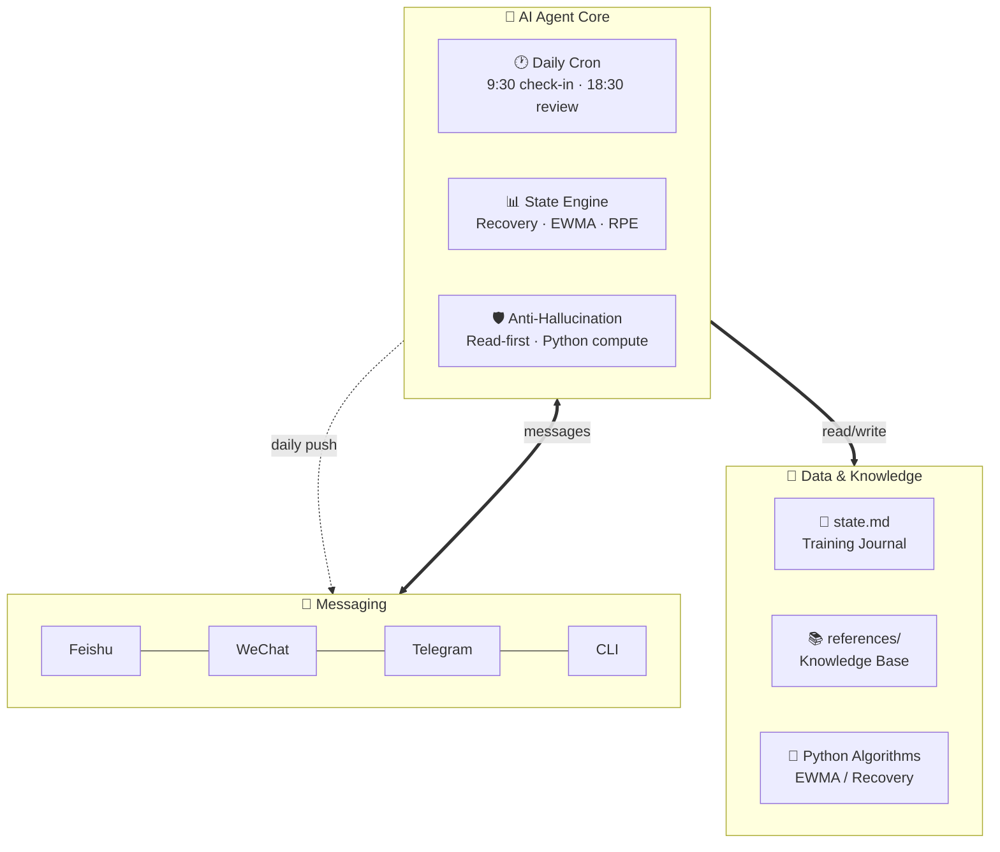

<p align="center">
  <b>🇺🇸 English</b> · <a href="README.md">🇨🇳 中文</a>
</p>

<h1 align="center">🏋️ TiSu · AI Fitness Coach Framework</h1>

<p align="center">
  <b>Turn your AI Agent into a 24/7 personal fitness coach</b><br>
  Works through Feishu / WeChat / Telegram — daily check-ins, state tracking, mesocycle programming
</p>

<p align="center">
  
  
  
  
</p>

---

## 🔥 In One Sentence

**Connect your AI Agent to messaging apps. It asks "how was your workout?" every day, adjusts plans dynamically based on your state. No apps to open, no logs to keep, no plans to write.**

---

## 🎯 First Run: 30-Second Profile Setup

The first time you load this skill, the Agent asks for your basics — once:

```
🏋️ Welcome to TiSu Fitness Coach!

Let me get to know you so I can tailor your training:

Gender: ? (Male / Female)
Age: ?
Height (cm): ?
Weight (kg): ?
Experience: ? (Beginner / Novice / Intermediate / Advanced)
Current Goal: ? (Muscle Gain / Fat Loss / Strength / Maintenance)
Days per week you can train: ?
Any injuries or limitations: ?
```

After you reply, the Agent stores this in `state.md` under **User Profile**. All subsequent calculations (1RM estimation, BMR, mesocycle design, progressive overload) are based on your personal data — no repeated questions.

> 💡 **Update anytime**: Just say "update my profile" or "I'm 80kg now" and the Agent patches `state.md` automatically.

---

## 🎯 What It Does

Instead of forcing you to open a fitness app and log manually, **TiSu flips the model** — the AI Agent messages you proactively through your chat app.

Every morning you get a message:

```
📱 [Feishu/WeChat/Telegram] Good morning! How are we feeling today?
  Weight: ? | Sleep: ? | Energy (1-10): ?
  Mood (1-10): ? | Stress (1-10): ?
```

Your reply:

```
175 | 7h | 8 | 9 | 4
```

The Agent automatically:
- ✅ Logs everything to your training journal (`state.md`)
- ✅ Computes EWMA weight trend with Python
- ✅ Calculates Recovery Score → decides push/maintain/deload
- ✅ Generates today's workout (Push/Pull/Legs + sets/reps/weights)
- ✅ Records RPE → auto-adjusts next session's weight

**No app to open. Your chat app IS your fitness coach UI.**

---

## 🏗️ Architecture



> 💡 **Flow**: Your message arrives from chat app → Agent processes (compute state, check knowledge, anti-hallucination guard) → Training plan pushed back. All automated, you just reply.

---

## ⏰ Daily Auto-Pilot

| Time | Action | What the Agent Does |
|------|--------|-------------------|
| **9:30 AM** 🐦 | Morning check-in | Read state.md → Ask 6 metrics → Compute Recovery → Generate plan |
| **Post-workout** 💪 | RPE logging | Ask "how was that set?" → Auto-adjust next weight |
| **6:30 PM** 🌆 | Evening review | Daily summary + autoregulation decision |
| **Monday 9:30** 📊 | Weekly report | 7-day trend analysis + next week recommendations |
| **1st of Month** 📈 | Monthly report | Mesocycle progress + strategy adjustment (bulk/cut switch) |

---

## 🛡️ Anti-Hallucination for Fitness

The #1 problem with AI fitness coaches: **fabricated exercises, made-up papers, invented timelines.**

| ❌ Common Hallucination | ✅ TiSu's Approach |
|------------------------|-------------------|
| "Ab wheel rollout requires quadriceps engagement" (fabricated anatomy) | `read_file` the reference first. If not found, say "I don't know" |
| "According to a 2019 RP study..." (invented citation) | Only cite content from `references/`. No citation = no claim |
| "You'll bench 80kg in 3 weeks" (invented timeline) | "Based on current EWMA trend +0.5kg/week, ~4-6 weeks **if consistent**" |
| Mental math on 1RM / EWMA (likely wrong) | Python computation with full trace shown |

---

## 💡 Design Philosophy

```
Data > Subjective    — EWMA beats single-day weight readings
State > Plan         — Recovery Score drives volume, not a fixed cycle
Proactive > Reactive — Agent asks first, doesn't wait for you
Algorithm > Guess    — Python compute, never mental math
Range > Date         — Give ranges (X-Y weeks), never specific dates
```

---

## 🚀 Quick Start

```bash
git clone https://github.com/chouxiangdick/TiSu.git
cd TiSu
cat SKILL.md
cat references/case-study-fitness-coach.md
```

**Requires an AI Agent framework** with cron scheduling + messaging gateway support (e.g. Hermes Agent).

---

## 📚 Repo Contents

| File | Description |
|------|-------------|
| `SKILL.md` | Core methodology: 4 pillars + 4 anti-hallucination rules + 11-step upgrade process |
| `references/algorithm-templates.md` | 6 Python algorithm templates (EWMA / 1RM / Recovery / Mesocycle / Autoregulation / Today field) |
| `references/cron-sync-checklist.md` | Multi-cron coordination + cross-file consistency checks |
| `references/case-study-fitness-coach.md` | Full case study: v1 (reactive) to v2 (proactive) fitness coach in 11 steps |

---

## 📜 License

MIT
